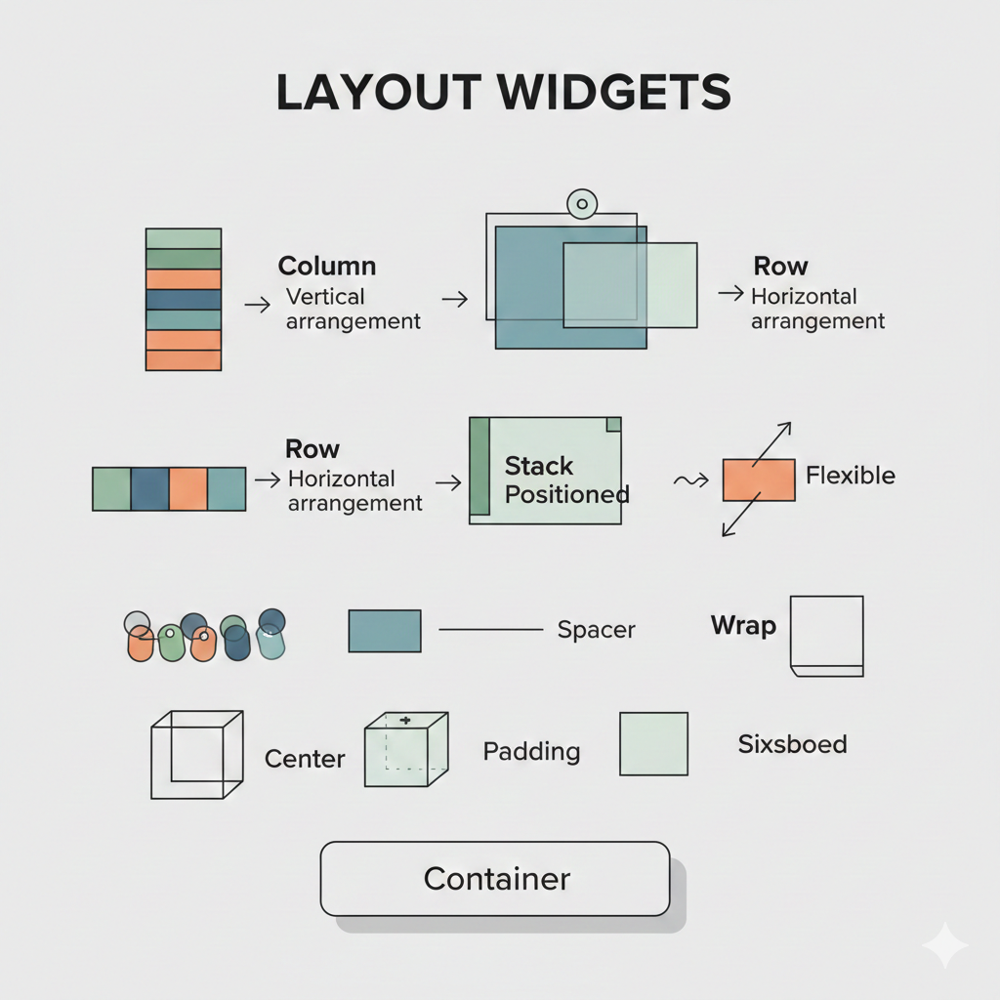
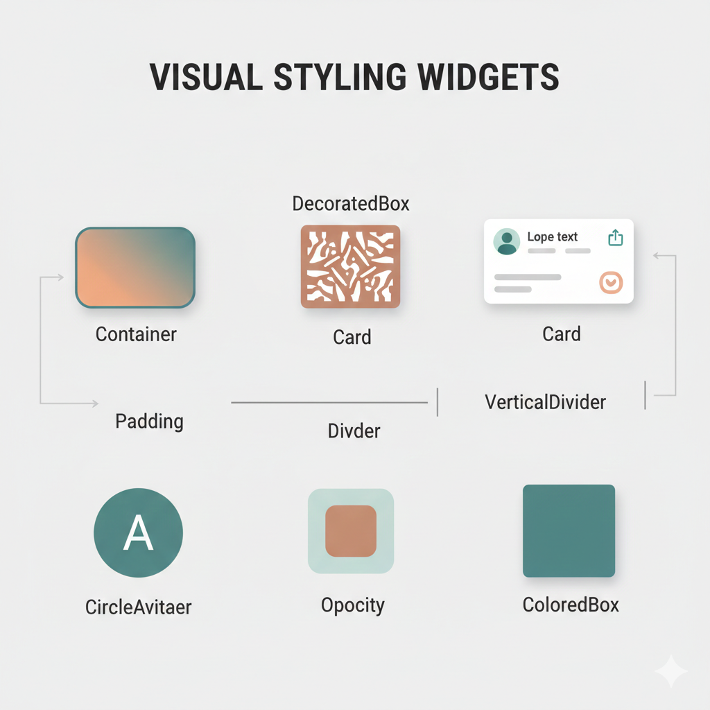
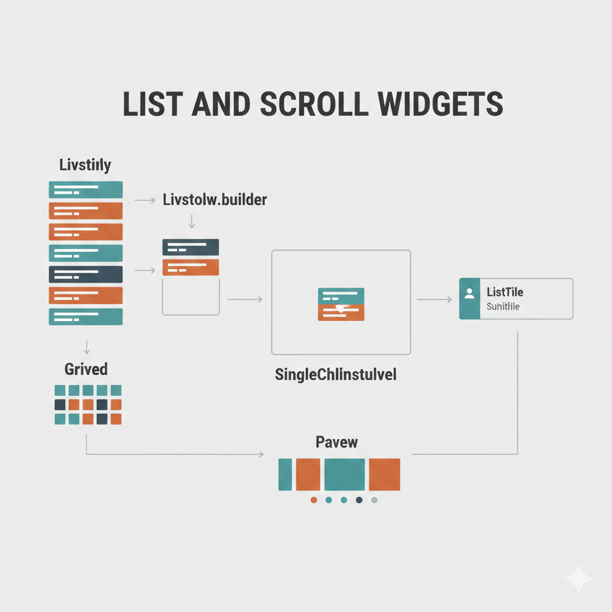
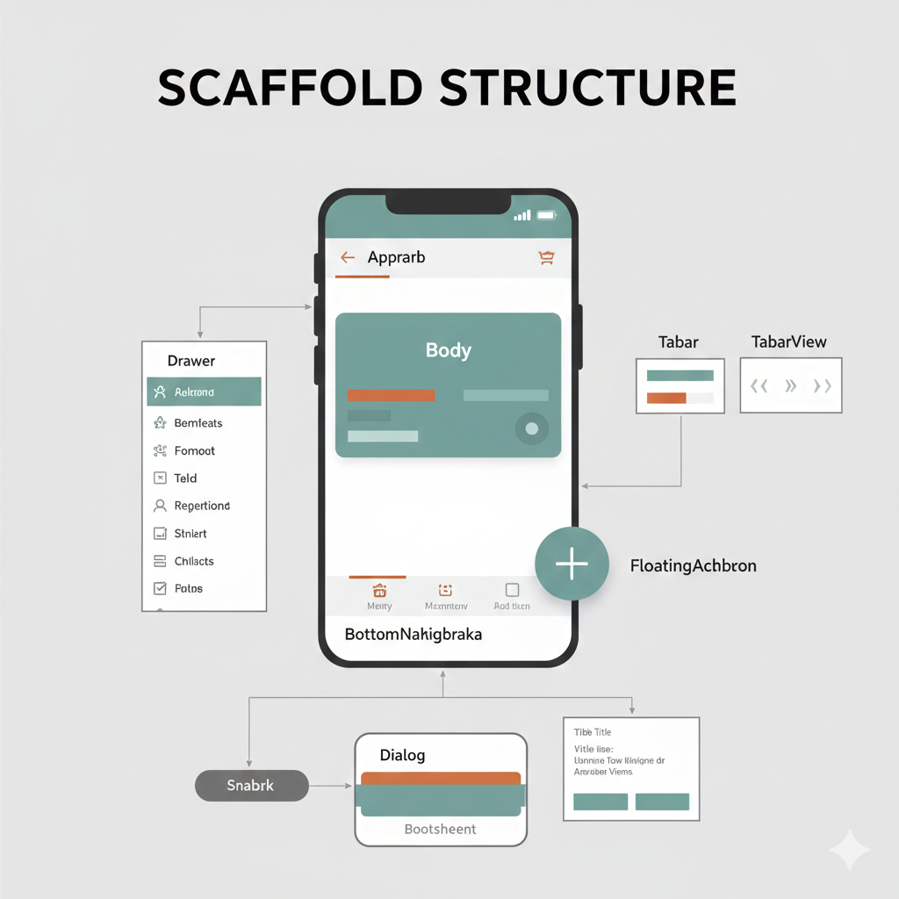
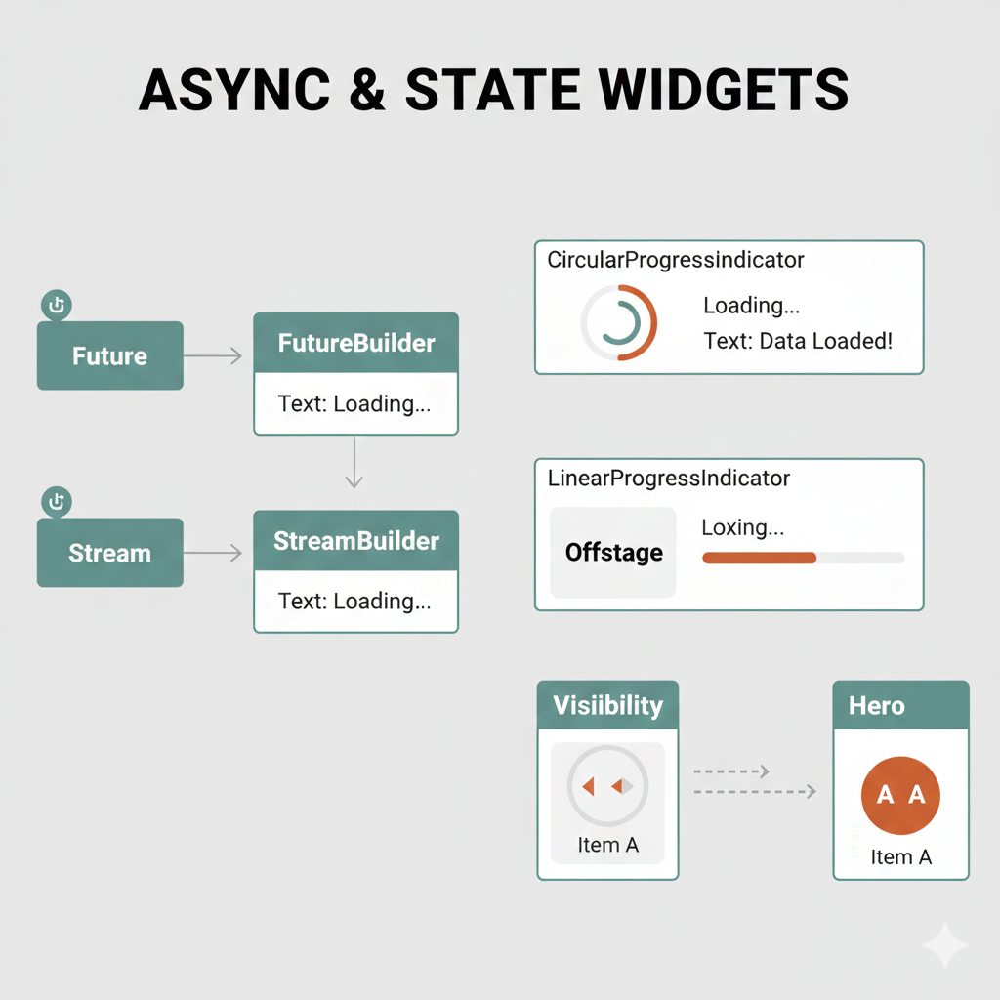

[[#GPT]]
Main element is Scaffold which contans whole screen -> app bar
```dart 
 Widget build(BuildContext context) {
    return Scaffold(appBar: AppBar(
	     elevation: 0.0, // this removes elevation (SHADOW)
    ));
  }
```

#App Bar
```dart
class _HomePageState extends State<HomePage> {
  @override
  Widget build(BuildContext context) {
    return Scaffold(
      appBar: appBar(), // this is top bar
      body: Column(   /// this is body and it have column with children
        children: [
          TextField(
            decoration: InputDecoration(
            filled: true, 
            fillColor: Colors.white),
          ),
        ],
      ),
    );
  }
```

#Text widget for displaying text  and its properties that are ususaly used :)
```dart
Text(
  'Hello World',
  style: TextStyle(
	color: Colors.white,
	fontSize: 18,
	fontWeight: FontWeight.bold,
  ),
```

#Container used for wrapping and styling containers inside
```dart
Container(
	margin: EdgeInsets.only(top: 40, left: 20, right: 20),
)
```

`Height i Width`
In case that you cannot use height and width 
use margin to resize element
also it might need `aligment: Aligment.center`

Full Example of the container
```dart
Container(
  alignment: Alignment.center,
  margin: EdgeInsets.all(10),
  decoration: BoxDecoration(
	color: Color(0xffF7F8F8),
	borderRadius: BorderRadius.circular(10),
  ),
  child: SvgPicture.asset('assets/icons/arrow_left.svg'),
),
```

#Gesture Detector on Tap

```dart
  GestureDetector(
	onTap: () {},
	child: Container(...)
	).
```
#### #AppBar full example [[99_full_elements_examples]]

#Row to show border items it must be wrapped into IntrisivHeights
```dart
IntrinsicHeight(
  child: Row( /// element
	mainAxisAlignment: MainAxisAlignment.end,
	children: [
	  VerticalDivider(
		color: Colors.black,
		thickness: 0.1,
		indent: 10,
		endIndent: 10,
	  ),
	  Padding(
		padding: const EdgeInsets.all(12),
		child: SvgPicture.asset('assets/icons/filter.svg'),
	  ),
	],
  ),
),
```

#SizedBox used to add space between containers
```dart
SizedBox(
	height:100,
)
```

#InkWell **tap + ripple + material feedback** za bilo koji widget.

`InkWell` je Flutter widget koji dodaje **material “ripple” (talasasti) efekat na dodir** i omogućava da bilo koji child reaguje na tap, long press, hover, itd.

Najčešće se koristi kada želiš da **nešto što nije dugme (Container, Row, Card, ListTile, itd.) ponaša kao dugme** uz vizuelni feedback.
```dart
Material(
  color: Colors.blue,
  child: InkWell(
    onTap: () {},
    child: Padding(
      padding: EdgeInsets.all(16),
      child: Text('Klikni me'),
    ),
  ),
)
```


# #GPT


# Najčešće korišćeni Flutter widgeti — praktičan pregled

> Ovaj dokument sadrži pregled widgeta koje ćeš najčešće koristiti u realnim Flutter projektima.
> Mesta za slike su ostavljena kao **image placeholders** — ubaci screenshotove ili dijagrame po želji.

---

## 🧱 Layout (raspored elemenata)



| Widget | Svrha |
|---|---|
| `Row` | Horizontalni raspored dece |
| `Column` | Vertikalni raspored dece |
| `Stack` | Elementi jedan preko drugog (overlay) |
| `Positioned` | Precizna pozicija unutar `Stack` |
| `Expanded` | Zauzima sav preostali prostor u Row/Column |
| `Flexible` | Fleksibilno širenje bez forsiranja |
| `Spacer` | Prazan fleksibilni razmak |
| `Wrap` | Automatski prelazak u novi red (chips, tagovi) |
| `Center` | Centrira child |
| `Align` | Poravnanje child-a |
| `Padding` | Unutrašnji razmak |
| `SizedBox` | Fiksna širina/visina ili razmak |
| `Container` | Wrapper za stil i raspored |

---

## 🎨 Vizuelni i stil



| Widget | Svrha |
|---|---|
| `Container` | Boja, ivice, senka, dimenzije |
| `DecoratedBox` | Dekoracija bez layout logike |
| `Card` | Material kartica sa elevation |
| `CircleAvatar` | Profilne slike/ikone |
| `Divider` | Horizontalna linija |
| `VerticalDivider` | Vertikalna linija |
| `ClipRRect` | Rounded ivice |
| `Opacity` | Providnost |
| `ColoredBox` | Samo boja (lakši od Container-a) |

---

## 🖱 Interakcija (dodir i gestovi)


| Widget | Svrha |
|---|---|
| `InkWell` | Tap + ripple efekat |
| `GestureDetector` | Detekcija gestova bez efekta |
| `IconButton` | Klikabilna ikona |
| `TextButton` | Tekst dugme |
| `ElevatedButton` | Primarno dugme |
| `OutlinedButton` | Dugme sa border-om |
| `FloatingActionButton` | Plutajuće akcijsko dugme |
| `MouseRegion` | Hover efekti |

---

## 📝 Tekst i unos podataka


| Widget | Svrha |
|---|---|
| `Text` | Prikaz teksta |
| `RichText` | Više stilova u jednom tekstu |
| `SelectableText` | Selektabilan tekst |
| `TextField` | Unos teksta |
| `TextFormField` | Unos sa validacijom |
| `Form` | Grupisanje polja |
| `Checkbox` | True/false |
| `Switch` | Toggle |
| `Radio` | Jedan izbor iz grupe |
| `DropdownButton` | Padajući meni |

---

## 📜 Liste i skrol



| Widget | Svrha |
|---|---|
| `ListView` | Skrolujuća lista |
| `ListView.builder` | Dinamičke velike liste |
| `GridView` | Mreža elemenata |
| `SingleChildScrollView` | Skrol za jedan child |
| `ListTile` | Standardni list item |
| `PageView` | Swipe između stranica |

---

## 🧭 Struktura ekrana (Scaffold ekosistem)



| Widget | Svrha |
|---|---|
| `Scaffold` | Osnova ekrana |
| `AppBar` | Gornja traka |
| `Drawer` | Bočni meni |
| `BottomNavigationBar` | Donja navigacija |
| `TabBar` / `TabBarView` | Tab navigacija |
| `SnackBar` | Kratke poruke |
| `Dialog` | Popup prozor |
| `BottomSheet` | Panel odozdo |

---

## 🧩 Async i state prikaz



| Widget | Svrha |
|---|---|
| `FutureBuilder` | Prikaz na osnovu Future |
| `StreamBuilder` | Prikaz na osnovu Stream |
| `CircularProgressIndicator` | Loader |
| `LinearProgressIndicator` | Progress bar |
| `Visibility` | Sakrij/prikaži |
| `Offstage` | Render bez prikaza |
| `Hero` | Animacija između ekrana |

---

## 🧭 Navigacija

| API | Svrha |
|---|---|
| `Navigator.push` | Novi ekran |
| `Navigator.pop` | Nazad |
| `MaterialPageRoute` | Standardna ruta |
| `showDialog` | Prikaži dialog |
| `showModalBottomSheet` | Bottom sheet |

---

## 🧠 Pomoćni widgeti

| Widget | Svrha |
|---|---|
| `Builder` | Novi context |
| `SafeArea` | Izbegava notch |
| `Theme` | Lokalna tema |
| `MediaQuery` | Dimenzije ekrana |
| `Expanded` + `SingleChildScrollView` | Rešava overflow |

---

## Suština

Ako znaš da koristiš:

`Scaffold, AppBar, Row, Column, Expanded, Container, Padding, ListView.builder, ListTile, InkWell, TextField, Card`

možeš da napraviš **90% realnih aplikacija**.
